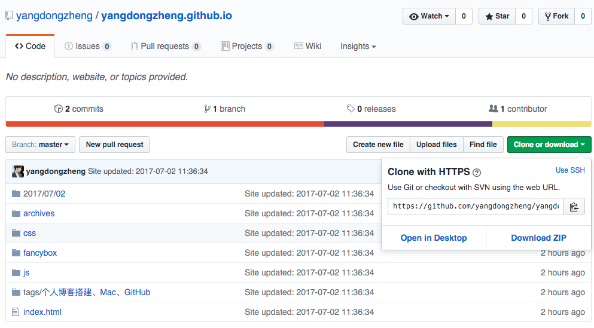

这是一篇详细文章来讲述用Mac搭建Hexo博客于Github上的完整历程， 也是踩了无数的坑搭起来的，现在写下些经验来分享，希望能帮大家少踩些坑

#### 1 环境配置

[Hexo官网](https://hexo.io/docs/)上本就有对Hexo安装及使用的详细介绍，墙裂推荐。这里来讲述自己安装的亲身步骤，或有区别

##### Node.js

用来生成静态页面。移步Node.js官网，下载v5.5.0 Stable 一路安装即可。

##### Git

用来将本地Hexo内容提交到Github上。Xcode自带Git，这里不再赘述。如果没有Xcode可以参考Hexo官网上的安装方法

#### 2 安装Hexo

当Node.js和Git都安装好后就可以正式安装Hexo了，终端执行如下命令：
``` bash
$ sudo npm install -g hexo
``` 
输入管理员密码（Mac登录密码）即开始安装 (sudo:linux系统管理指令  -g:全局安装

#### 3 初始化

终端cd到一个你选定的目录，执行hexo init命令：
``` bash
$ hexo init blog
``` 
blog是你建立的文件夹名称。cd到blog文件夹下，执行如下命令，安装npm
``` bash
$ npm install
``` 
执行如下命令，开启hexo服务器：
``` bash
$ hexo s
``` 
此时，浏览器中打开网址http://localhost:4000，能看到如下页面：
[图片的使用参考](http://www.tuicool.com/articles/umEBVfI)


#### 4 关联Github
登录你的Github帐号，新建仓库，名为用户名.github.io固定写法，如yangdongzheng.github.io即下图所示：


本地的blog文件夹下内容为：
``` bash
_config.yml    
db.json 
node_modules 
package.json
scaffolds
source
themes
``` 
打开_config.yml往下滑到最后，修改成下边的样子：
``` bash
deploy:
    type: git
    repository: https://github.com/yangdongzheng/yangdongzheng.github.io.git
    branch: master
``` 
将repository后yangdongzheng换成你自己的用户名，hexo 3.1.1版本后type:值为git。
* 注意：在配置所有的_config.yml文件时（包括theme中的），
在所有的冒号:后边都要加一个空格，否则执行hexo命令会报错，切记 切记

在blog文件夹目录下执行生成静态页面命令：
``` bash
$ hexo generate 或者：hexo g
``` 

* 此时若出现如下报错：
ERROR Local hexo not found in ~/blog
ERROR Try runing: 'npm install hexo --save'
则执行命令：
``` bash
npm install hexo --save
``` 
若无报错，自行忽略此步骤。

再执行配置命令：
``` bash
$ hexo deploy 或者：hexo d
``` 

* 若执行命令hexo deploy仍然报错：无法连接git或找不到git，则执行如下命令来安装hexo-deployer-git：
``` bash
$ npm install hexo-deployer-git --save
``` 

再次执行hexo generate和hexo deploy命令。

若你未关联Github，则执行hexo deploy命令时终端会提示你输入Github的用户名和密码，即

Username for 'https://github.com':
Password for 'https://github.com':
hexo deploy命令执行成功后，浏览器中打开网址http://yangdongzheng.github.io
（将yangdongzheng换成你的用户名）能看到和打开http://localhost:4000  时一样的页面。


### 参考链接
[其他搭建博客链接1](http://www.cnblogs.com/xiaoxuetu/p/hexo-guide.html)
[其他搭建博客链接2](http://www.jianshu.com/p/13e64c9e2295)
[MarkDown使用手册](http://www.appinn.com/markdown/#em)


